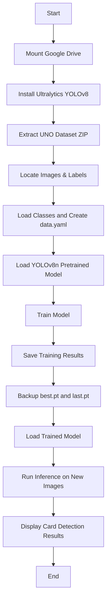
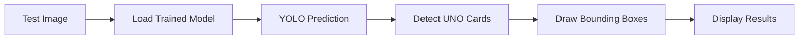

# 🃏 UNO Game Card Recognition using YOLOv8

## Overview
This project trains a YOLOv8 object detection model to recognize UNO game cards from images. The notebook provides an end-to-end workflow, from dataset preparation to model training, saving, and inference.

---

## Project Workflow



---

## Features

- Automatic dataset extraction
- Automatic image and label discovery
- Dynamic `data.yaml` generation
- YOLOv8 Nano model training
- Google Drive integration
- Model checkpoint backup
- UNO card detection and inference

---

## Project Structure

```text
project/
│
├── UNo_Game_Card_Recognation_Notebook.ipynb
├── README.md
│
├── dataset/
│   ├── images/
│   ├── labels/
│   └── classes.txt
│
├── data.yaml
│
└── weights/
    ├── best.pt
    └── last.pt
```

---

## Training Pipeline

### 1. Mount Google Drive

```python
from google.colab import drive
drive.mount('/content/drive')
```

### 2. Install YOLOv8

```python
!pip install ultralytics -q
```

### 3. Extract Dataset

```python
import zipfile
zip_ref.extractall(extract_path)
```

### 4. Create YOLO Configuration

The notebook:

- Finds image folders
- Finds label folders
- Loads class names
- Generates `data.yaml`

### 5. Train Model

```python
from ultralytics import YOLO

model = YOLO("yolov8n.pt")

model.train(
    data="/content/data.yaml",
    epochs=120,
    imgsz=640,
    batch=8,
    patience=25
)
```

---

## Training Configuration

| Parameter | Value |
|------------|--------|
| Model | YOLOv8n |
| Epochs | 120 |
| Image Size | 640 |
| Batch Size | 8 |
| Patience | 25 |

---

## Saving Model

The notebook stores:

- `best.pt` → Best performing model
- `last.pt` → Latest checkpoint

Google Drive is used for permanent storage and backup.

---

## Inference Workflow



### Load Model

```python
from ultralytics import YOLO

model = YOLO("best.pt")
```

### Predict

```python
results = model.predict(
    source="test_image.jpg",
    conf=0.25
)
```

---

## Requirements

```bash
pip install ultralytics
pip install opencv-python
pip install matplotlib
```

---

## Output

After training, the project generates:

- Trained YOLOv8 weights
- Detection predictions
- Bounding box visualizations
- Training metrics and logs

---

## Objective

Develop a computer vision system capable of automatically recognizing UNO game cards using YOLOv8 object detection.
